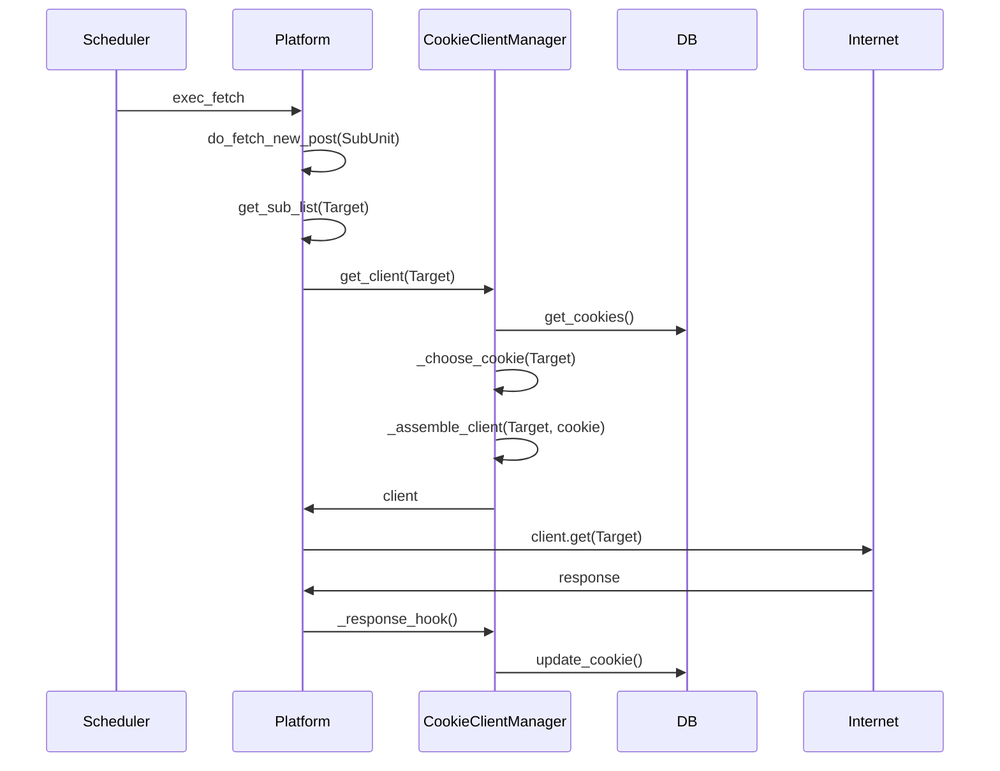

# Cookie 开发须知

本项目将大部分 Cookie 相关逻辑提出到了 Site 及 Client Manger 模块中，你只需要继承相关类即可获得使用 Cookie 的能力。

::: tip

在开发Cookie功能之前，你应该对[基本开发](/dev/#基本开发)有一定的了解。

:::

## Cookie相关的基本概念

- `nonebot_bison.config.db_model.Cookie`: 用于存储Cookie的实体类，包含了Cookie的名称、内容、状态等信息
- `nonebot_bison.config.db_model.CookieTarget`: 用于存储Cookie与订阅的关联关系
- `nonebot_bison.utils.site.CookieClientManager`: 添加了Cookie功能的ClientManager，是Cookie管理功能的核心，调度Cookie的功能就在这里实现
- `nonebot_bison.utils.site.CookieSite`: 添加了Cookie功能的Site类，根据需求添加了和Site强相关的Cookie功能实现方法

## 快速上手

例如，你现在有一个这样子的 Site 类：

```python
class WeiboSite(Site):
  name = "weibo.com"
  schedule_type = "interval"
  schedule_setting = {"seconds": 3}
```

简而言之，要让你的站点获得 Cookie 能力，只需要：

1. 将父类从`Site`改为`CookieSite`

```python {1}
class WeiboSite(CookieSite):
  name = "weibo.com"
  schedule_type = "interval"
  schedule_setting = {"seconds": 3}
```

2. 为你的 Site 类添加一个`client_mgr`属性

```python {5}
class WeiboSite(CookieSite):
  name = "weibo.com"
  schedule_type = "interval"
  schedule_setting = {"seconds": 3}
  client_mgr = create_cookie_client_manager(name)
```

至此，你的站点就可以使用 Cookie 了！

## 更好的体验

为了给用户提供更好的体验，你还可以为你的Site重写`validate_cookie`和`get_target_name`方法。

- `async def validate_cookie(cls, content: str) -> bool`该方法将会在Cookie添加时被调用，你可以在这里验证Cookie的有效性
- `async def get_cookie_name(cls, content: str) -> str`该方法将会在验证Cookie成功后被调用，你可以在这里设置Cookie的名字并展示给用户

## 我要自己调度Cookie

当默认的Cookie调度逻辑无法满足你的需求时，你可以重写`CookieClientManager`的`get_cookie`方法。

目前整体的调度逻辑是：


