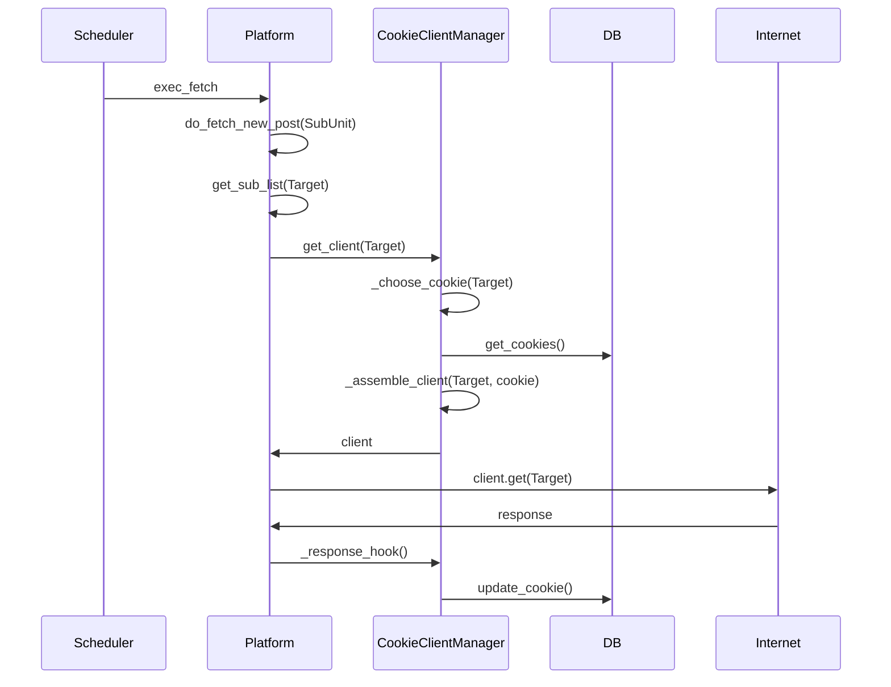

# Cookie 开发须知

本项目将大部分 Cookie 相关逻辑提出到了 Site 及 ClientManger 模块中，只需要继承相关类即可获得使用 Cookie 的能力。

::: tip

在开发 Cookie 功能之前，你应该对[基本开发](/dev/#基本开发)有一定的了解。

:::

## Cookie 相关的基本概念

- `nonebot_bison.config.db_model.Cookie`: 用于存储 Cookie 的实体类，包含了 Cookie 的名称、内容、状态等信息
- `nonebot_bison.config.db_model.CookieTarget`: 用于存储 Cookie 与订阅的关联关系
- `nonebot_bison.utils.site.CookieClientManager`: 添加了 Cookie 功能的 ClientManager，是 Cookie 管理功能的核心，调度 Cookie 的功能就在这里实现

## 快速上手

例如，现在有一个这样子的 Site 类：

```python
class WeiboSite(Site):
  name = "weibo.com"
  schedule_type = "interval"
  schedule_setting = {"seconds": 3}
```

简而言之，要让站点获得 Cookie 能力，只需要：

为 Site 类添加一个`client_mgr`字段，值为`CookieClientManager.from_name(name)`，其中`name`为站点名称，这是默认的 Cookie 管理器。

```python {5}
class WeiboSite(Site):
  name = "weibo.com"
  schedule_type = "interval"
  schedule_setting = {"seconds": 3}
  client_mgr = CookieClientManager.from_name(name)
```

至此，站点就可以使用 Cookie 了！

## 更好的体验

为了给用户提供更好的体验，还可以创建自己的 `ClientManager`：继承 `CookieClientManager` 并重写`validate_cookie`和`get_target_name`方法。

- `async def validate_cookie(cls, content: str) -> bool`该方法将会在 Cookie 添加时被调用，可以在这里验证 Cookie 的有效性
- `async def get_cookie_name(cls, content: str) -> str`该方法将会在验证 Cookie 成功后被调用，可以在这里设置 Cookie 的名字并展示给用户

## 自定义 Cookie 调度策略

当默认的 Cookie 调度逻辑无法满足需求时，可以重写`CookieClientManager`的`_choose_cookie`方法。

目前整体的调度逻辑是：



目前 CookieClientManager 具有以下方法

- `refresh_anonymous_cookie(cls)` 移除已有的匿名 cookie，添加一个新的匿名 cookie，应该在 CCM 初始化时调用
- `add_user_cookie(cls, content: str)` 添加用户 cookie，在这里对 Cookie 进行检查并获取 cookie_name，写入数据库
- `_generate_hook(self, cookie: Cookie) -> Callable` hook 函数生成器，用于回写请求状态到数据库
- `_choose_cookie(self, target: Target) -> Cookie` 选择 cookie 的具体算法
- `add_user_cookie(cls, content: str, cookie_name: str | None = None) -> Cookie` 对外的接口，添加用户 cookie，内部会调用 Site 的方法进行检查
- `get_client(self, target: Target | None) -> AsyncClient` 对外的接口，获取 client，根据 target 选择 cookie
- `_assemble_client(self, client, cookie) -> AsyncClient` 组装 client，可以自定义 cookie 对象的 content 装配到 client 中的方式

::: details 大致流程

1. `Platfrom` 调用 `CookieClientManager.get_client` 方法，传入 `Target` 对象
2. `CookieClientManager` 根据 `Target` 选择一个 `Cookie` 对象
3. `CookieClientManager` 调用 `CookieClientManager._assemble_client` 方法，将 Cookie 装配到 `Client` 中
4. `Platform` 使用 `Client` 进行请求
   :::

简单来说：

- 如果需要修改 Cookie 的默认参数，可以重写`add_user_cookie`方法，这里设置需要的字段
- 如果需要修改选择 Cookie 的逻辑，可以重写`_choose_cookie`方法，使用自己的算法选择合适的 Cookie 并返回
- 如果需要自定义 Cookie 的格式，可以重写`valid_cookie`方法，自定义验证 Cookie 的逻辑，并重写`_assemble_client`方法，自定义将 Cookie 装配到 Client 中的逻辑
- 如果要在请求结束后做一些操作（例如保存此次请求的结果/状态），可以重写`_response_hook`方法，自定义请求结束后的行为
- 如果需要跳过一次请求，可以在 `get_client` 方法中抛出 `SkipRequestException` 异常，调度器会捕获该异常并跳过此次请求

## 实名 Cookie 和匿名 Cookie

部分站点所有接口都需要携带 Cookie，对于匿名用户（未登录）也会发放一个临时 Cookie，本项目称为匿名 Cookie。

在此基础上，我们添加了用户上传 Cookie 的功能，这种 Cookie 本项目称为实名 Cookie。

匿名 Cookie 和实名 Cookie 在同一个框架下统一调度，实名 Cookie 优先级高于匿名 Cookie。为了调度，Cookie 对象有以下字段：

```python
    # 最后使用的时刻
    last_usage: Mapped[datetime.datetime] = mapped_column(DateTime, default=datetime.datetime(1970, 1, 1))
    # Cookie 当前的状态
    status: Mapped[str] = mapped_column(String(20), default="")
    # 使用一次之后，需要的冷却时间
    cd_milliseconds: Mapped[int] = mapped_column(default=0)
    # 是否是通用 Cookie（对所有 Target 都有效）
    is_universal: Mapped[bool] = mapped_column(default=False)
    # 是否是匿名 Cookie
    is_anonymous: Mapped[bool] = mapped_column(default=False)
    # 标签，扩展用
    tags: Mapped[dict[str, Any]] = mapped_column(JSON().with_variant(JSONB, "postgresql"), default={})
```

其中：

- **is_universal**：用于标记 Cookie 是否为通用 Cookie，即对所有 Target 都有效。可以理解为是一种特殊的 target，添加 Cookie 和获取 Cookie 时通过传入参数进行设置。

- **is_anonymous**：用于标记 Cookie 是否为匿名 Cookie，目前的定义是：可以由程序自动生成的，适用于所有 Target 的 Cookie。目前的逻辑是 bison 启动时，生成一个新的匿名 Cookie 并替换掉原有的匿名 Cookie。

- **无 Target 平台的 Cookie 处理方式**

  对于不存在 Target 的平台，如小刻食堂，可以重写 add_user_cookie 方法，为用户 Cookie 设置 is_universal 字段。这样，在获取 Client 时，由于传入的 Target 为空，就只会选择 is_universal 的 cookie。实现了无 Target 平台的用户 Cookie 调度。

## 默认的调度策略

默认的调度策略在 CookieClientManager 的 `_choose_cookie` 方法中实现：

```python
  async def _choose_cookie(self, target: Target | None) -> Cookie:
      """选择 cookie 的具体算法"""
      cookies = await config.get_cookie(self._site_name, target)
      cookies = (cookie for cookie in cookies if cookie.last_usage + cookie.cd < datetime.now())
      cookie = min(cookies, key=lambda x: x.last_usage)
      return cookie
```

简而言之，会选择最近使用时间最早的 Cookie，且不在冷却时间内的 Cookie。

在默认情况下，匿名 Cookie 的冷却时间为 0，实名 Cookie 的冷却时间为 10 秒。也就是说，调度时，如果没有可用的实名 Cookie，则会选择匿名 Cookie。
